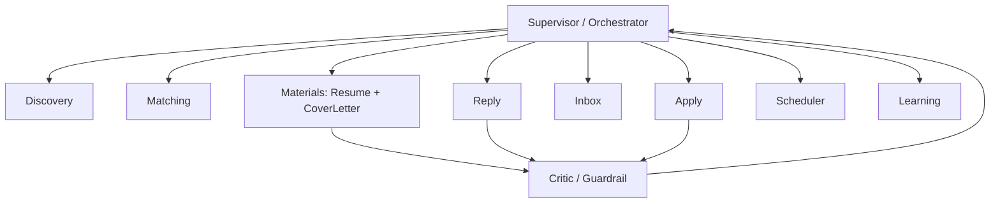
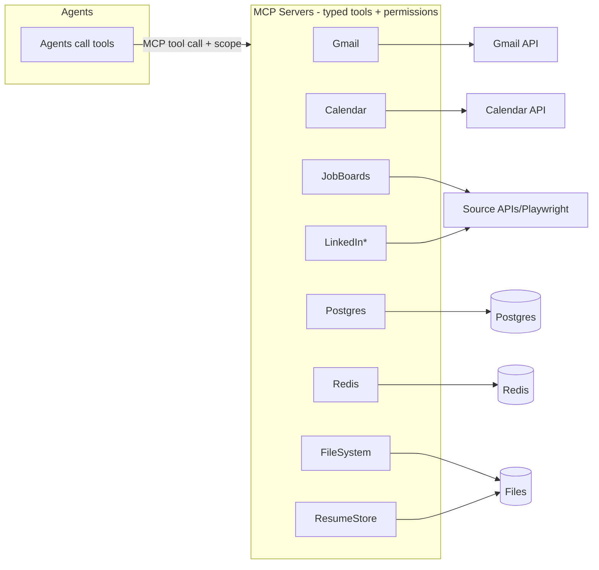

# Agent & MCP Architecture (overview)

> Phase 3 · Status: Draft v0.1 · 2026-05-30
> Deep detail in `../ai/` (agents) and `../mcp/` (MCP servers). This is the architectural
> bridge between them.

## 1. Agent architecture (supervisor pattern)

- **Supervisor** decides which sub-agent runs next based on workflow state.
- **Critic/Guardrail** is a mandatory reviewer on any path that produces outward content
  (materials, replies, submissions) — enforces honesty + safety + quality.
- Sub-agents are **tool-using** but tools are MCP-mediated only.

## 2. MCP architecture

## 3. Why MCP (vs. direct SDK calls)
- **Uniform tool contract** (typed inputs/outputs via JSON Schema/zod).
- **Permission boundary**: each server enforces scopes + rate limits independent of agents.
- **Testability**: servers mockable; agents test against contracts.
- **Reuse**: Gmail/Calendar/JobBoard MCP servers are standalone, reusable assets.
- **Fit**: Nikhil has shipped production MCP servers already (resume).
See `../adr/ADR-004-why-mcp.md`.

## 4. Agent ↔ tool permission matrix (summary)
| Agent | Allowed MCP tools |
|-------|-------------------|
| Discovery | JobBoards.read, LinkedIn.read*, Postgres.write(jobs), Redis |
| Matching | Postgres.read/write(scores), embeddings, Redis |
| Materials | ResumeStore, FileSystem, Postgres.read(profile) |
| Critic | Postgres.read(profile) |
| Apply | JobBoards.apply, Postgres.write(applications), Audit |
| Inbox | Gmail.read, Postgres.write(messages) |
| Reply | Gmail.send (post-approval), Postgres |
| Scheduler | Calendar.read/write, Gmail.send (post-approval) |
| Learning | Postgres.read/write(params) |
Outward tools (Gmail.send, JobBoards.apply, Calendar.write) require an approval token
in HITL mode (enforced by ApprovalService + MCP permission check).
