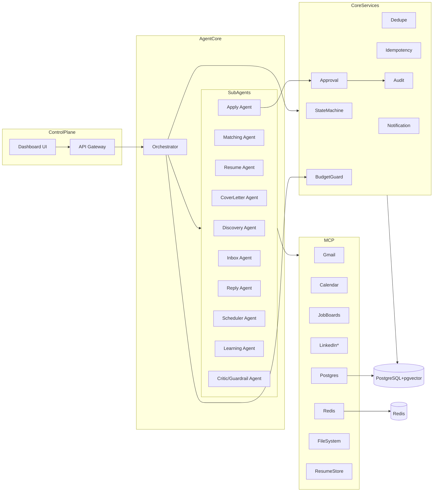
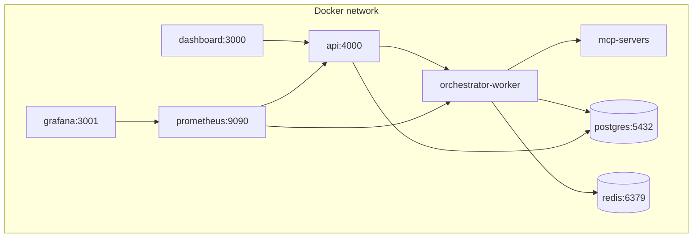

# Component & Service Diagrams

> Phase 3 · Status: Draft v0.1 · 2026-05-30

## 1. Component diagram (Mermaid)

## 2. Service responsibilities
| Service/Component | Responsibility | Key deps |
|-------------------|----------------|----------|
| Dashboard UI | Review/approve/configure/analytics | API GW (tRPC/WS) |
| API Gateway | AuthZ, validation, routing, WS push | Orchestrator, Core, DB |
| Orchestrator | Run LangGraph workflows, gate approvals | Agents, MCP, BudgetGuard |
| Discovery Agent | Fetch+normalize jobs | JobBoards/LinkedIn MCP |
| Matching Agent | Score+rank jobs | Postgres(pgvector), embeddings |
| Resume/Cover Agent | Generate materials | ResumeStore, FileSystem, LLM |
| Critic/Guardrail | Fabrication + quality + safety checks | Postgres (profile) |
| Apply Agent | Submit applications | JobBoards MCP / Playwright |
| Inbox Agent | Detect+classify+link emails | Gmail MCP |
| Reply Agent | Draft replies | Gmail MCP, LLM |
| Scheduler Agent | Availability + events | Calendar MCP |
| Learning Agent | Outcome attribution + weight updates | Postgres |
| Approval/Audit | HITL gate + immutable log | Postgres |
| BudgetGuard | Spend tracking + caps | Redis, Postgres |

## 3. Deployment/service diagram (Mermaid)

