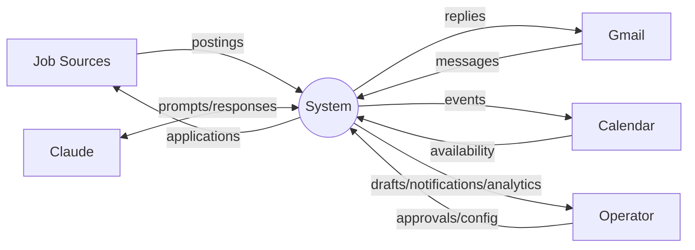
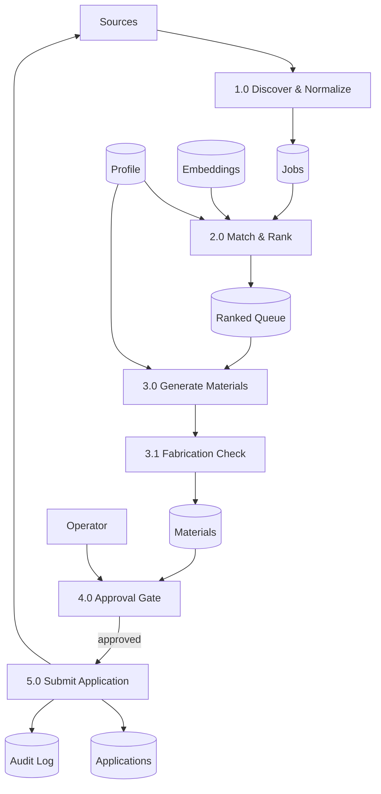
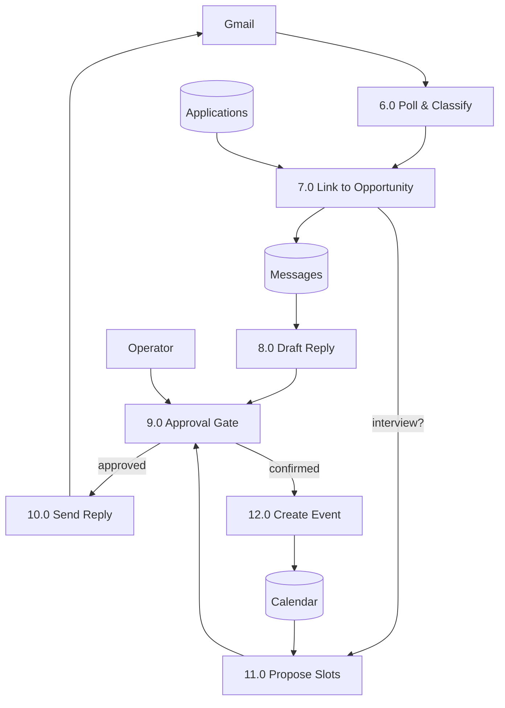

# Data Flow Diagrams

> Phase 3 · Status: Draft v0.1 · 2026-05-30

## 1. Level-0 DFD (context)

## 2. Level-1 DFD (primary pipeline)

## 3. Level-1 DFD (communications)

## 4. Data classification (what flows where)
| Data | Sensitivity | Leaves infra? |
|------|-------------|----------------|
| Master profile facts | Personal | Only relevant excerpts → LLM |
| Job postings | Public | n/a |
| Email content | Sensitive | Excerpts → LLM for classify/draft |
| OAuth tokens | Secret | Never to LLM/logs |
| Generated materials | Personal | To target ATS on submit |
| Audit log | Sensitive | Stays in Postgres |
| Embeddings | Derived | Stay in pgvector |

## 5. Retention
- Raw source payloads: 30 days (then drop, keep normalized Job).
- Email bodies: store minimal needed for context; configurable retention.
- Audit log: indefinite (append-only).
- Materials: versioned, kept for learning/audit.
