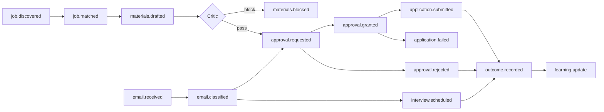

# Event Flow

> Phase 3 · Status: Draft v0.1 · 2026-05-30

## 1. Event catalog
| Event | Emitted by | Consumed by |
|-------|-----------|-------------|
| `job.discovered` | Discovery | Matching |
| `job.matched` | Matching | Materials selector / Notification |
| `materials.drafted` | Materials | Critic |
| `materials.blocked` | Critic | Notification (operator) |
| `approval.requested` | ApprovalService | Notification, Dashboard |
| `approval.granted` | Operator | Apply / Reply / Scheduler |
| `approval.rejected` | Operator | Learning, StateMachine |
| `application.submitted` | Apply | Audit, Tracking |
| `application.failed` | Apply | Notification (NEEDS_MANUAL) |
| `email.received` | Gmail poller | Inbox |
| `email.classified` | Inbox | Reply / Scheduler |
| `reply.sent` | Reply | Tracking |
| `interview.scheduled` | Scheduler | Tracking, Notification |
| `outcome.recorded` | Tracking | Learning |
| `budget.threshold` | BudgetGuard | Notification |
| `budget.capped` | BudgetGuard | Orchestrator (pause), Notification |

## 2. Event flow (Mermaid)


## 3. Delivery semantics
- **At-least-once** delivery via BullMQ; consumers are **idempotent** (event id + dedupe).
- Ordering per Opportunity preserved via a per-opportunity job key where it matters.
- Failed events → retries with backoff → DLQ + operator alert.

## 4. Event envelope
```ts
interface DomainEvent<T = unknown> {
  id: string;              // uuid
  type: string;            // e.g. "application.submitted"
  occurredAt: string;      // ISO
  opportunityId?: string;
  actor: 'system' | 'operator' | string;
  payload: T;
  traceId: string;         // OpenTelemetry correlation
}
```
Events are also persisted to an `events` table for audit + replay.
