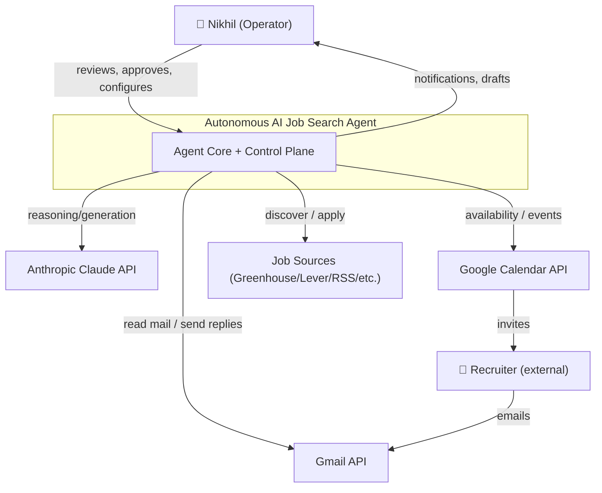
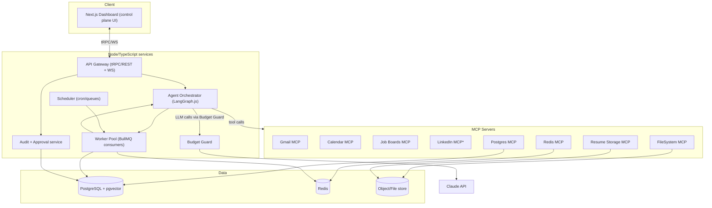

# High-Level Architecture (HLD)

> Phase 3 · Status: Draft v0.1 · 2026-05-30

> ⚠️ **As-built note:** orchestration shipped as plain TS services + BullMQ + DB state, **not**
> LangGraph (ADR-009); tools are in-process adapters with MCP servers wrapping the same modules
> for external clients (ADR-008). The model below is the conceptual target.

## 1. Architectural style
- **Event-driven, queue-backed, agentic.** A scheduler and event bus drive long-running
  workflows; an LLM orchestrator (LangGraph.js) coordinates specialized sub-agents that
  act only through **MCP tool servers**. A **Next.js dashboard** is the human control
  plane. PostgreSQL (+pgvector) is the system of record; Redis backs queues + cache.
- **Human-in-the-loop** is a first-class architectural control: outward actions pass
  through an Approval Gate.

## 2. Logical layers
1. **Sources layer** — adapters per job source (API/RSS/GraphQL/browser).
2. **Tool layer (MCP servers)** — Gmail, Calendar, Job Boards, LinkedIn, Postgres,
   Redis, File System, Resume Storage. The *only* way agents touch the outside world.
3. **Agent layer** — orchestrator + sub-agents (Discovery, Matching, Resume, Cover
   Letter, Apply, Inbox, Reply, Scheduler, Learning, Critic/Guardrail).
4. **Domain/services layer** — business logic, state machine, idempotency, dedupe,
   budget guard, audit.
5. **Data layer** — PostgreSQL (+pgvector), Redis, object/file storage.
6. **Control plane** — Next.js dashboard + REST/tRPC API + WebSocket.
7. **Cross-cutting** — auth/secrets, observability, notifications, scheduling.

## 3. C4 — System Context (Mermaid)

## 4. C4 — Container diagram (Mermaid)

`*` LinkedIn MCP is feature-flagged and compliance-gated; may be feed/API-only.

## 5. Runtime topology (local-first)
- A single `docker-compose.yml` brings up: `api`, `orchestrator/worker`, `dashboard`,
  `postgres`, `redis`, and each MCP server as its own small service (or in-process
  plugins behind the orchestrator for v1 simplicity). Prometheus + Grafana optional.

## 6. Key qualities & how the architecture delivers them
| Quality | Mechanism |
|---------|-----------|
| Safety/HITL | Approval Gate between draft and outward action; audit service |
| Honesty | Critic/Guardrail agent + fabrication check before materials are usable |
| Idempotency | Dedupe keys, idempotency table, unique (company,role) constraint |
| Resilience | BullMQ retries w/ backoff, resumable LangGraph state, DLQ |
| Cost control | Budget Guard wraps all LLM calls; caching; model tiering |
| Observability | Structured logs + OpenTelemetry traces + Prometheus metrics |
| Security | MCP permission model, encrypted secrets, scoped OAuth |
| Portability | Containerized; config-driven; local ↔ AWS parity |

## 7. Technology mapping
See `../../CLAUDE.md` Technology Stack and `../adr/` for rationale. Summary: Node 20+,
TypeScript, LangGraph.js, Anthropic SDK, MCP, Playwright, BullMQ, PostgreSQL 16 +
pgvector, Redis 7, Next.js + Tailwind + TanStack Query, Docker, GitHub Actions,
Prometheus/Grafana.
