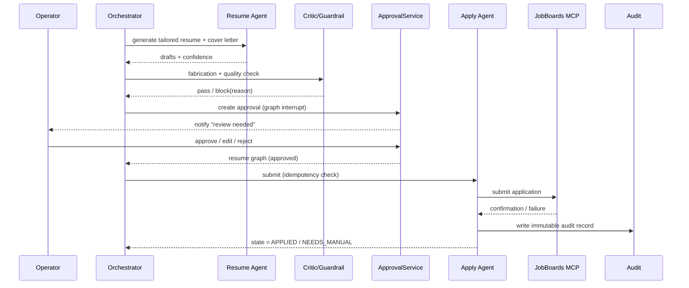
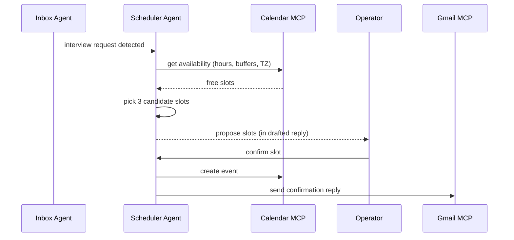

# Sequence Diagrams

> Phase 3 · Status: Draft v0.1 · 2026-05-30

## SD-1 — Discovery → Match
```mermaid
sequenceDiagram
    participant Sch as Scheduler
    participant DQ as discovery queue
    participant DA as Discovery Agent
    participant JB as JobBoards MCP
    participant DB as Postgres
    participant MA as Matching Agent
    Sch->>DQ: enqueue per-source job
    DQ->>DA: consume
    DA->>JB: fetch postings (rate-limited)
    JB-->>DA: raw postings
    DA->>DA: normalize + dedupe
    DA->>DB: upsert Jobs (+provenance)
    DA->>MA: enqueue matching
    MA->>DB: load profile + embeddings
    MA->>MA: score + rationale + confidence
    MA->>DB: persist scores; rank queue
    MA-->>Sch: notify if high-value matches
```

## SD-2 — Materials → Approval → Apply (HITL)


## SD-3 — Recruiter email → Reply (HITL)
```mermaid
sequenceDiagram
    participant GM as Gmail MCP
    participant IA as Inbox Agent
    participant DB as Postgres
    participant RP as Reply Agent
    participant CG as Critic/Guardrail
    participant OP as Operator
    GM-->>IA: new message (poll)
    IA->>IA: classify (recruiter/invite/reject/offer)
    IA->>DB: link to Opportunity
    IA->>RP: request draft
    RP->>DB: load thread + application context
    RP-->>CG: draft reply
    CG-->>OP: notify; show draft
    OP->>CG: approve/edit
    CG->>GM: validate recipient+thread, send
    GM-->>DB: update timeline
```

## SD-4 — Interview scheduling


## SD-5 — Learning loop
```mermaid
sequenceDiagram
    participant EV as Outcome Event
    participant LA as Learning Agent
    participant DB as Postgres
    EV->>LA: outcome (response/interview/offer/reject/ghost)
    LA->>DB: load features (source, role, variant, score)
    LA->>LA: attribute + update weights/guidance
    LA->>DB: persist params (versioned, reversible)
    LA-->>EV: ack; future ranking reflects update
```

## SD-6 — Budget guard around an LLM call
```mermaid
sequenceDiagram
    participant AG as Any Agent
    participant BG as BudgetGuard
    participant LLM as Claude API
    AG->>BG: request(model, est tokens)
    BG->>BG: check running spend vs cap
    alt under cap
      BG->>LLM: call
      LLM-->>BG: response + usage
      BG->>BG: record spend; maybe alert at threshold
      BG-->>AG: response
    else at cap
      BG-->>AG: GuardrailError(budget) + notify operator
    end
```
