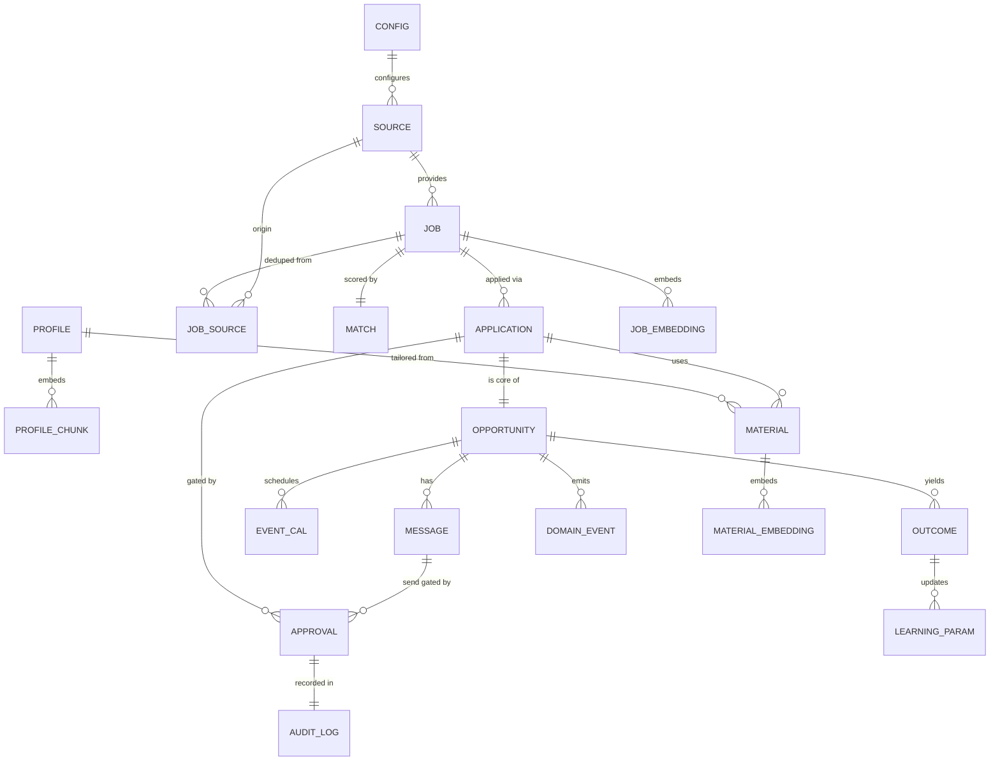

# Entity-Relationship Diagram (ERD)

> Phase 6 · Status: Draft v0.1 · 2026-05-30 · DB: PostgreSQL 16 + pgvector

## ERD (Mermaid)

## Entity summary
| Entity | Purpose |
|--------|---------|
| PROFILE | Master profile (source of truth for facts) |
| PROFILE_CHUNK / *_EMBEDDING | Chunked + vectorized corpora for RAG |
| SOURCE | A configured job source + its limits/state |
| JOB | Canonical normalized posting |
| JOB_SOURCE | Provenance linking a Job to one or more sources |
| MATCH | Score/rationale/confidence for a Job vs. profile |
| APPLICATION | An application instance + lifecycle state |
| MATERIAL | Versioned resume/cover-letter artifact |
| OPPORTUNITY | The end-to-end unit (job+application+thread) |
| MESSAGE | An email tied to an opportunity |
| EVENT_CAL | A calendar event (interview) |
| APPROVAL | A human approval record (HITL gate) |
| AUDIT_LOG | Append-only, hash-chained audit of outward actions |
| OUTCOME | Recorded result for learning |
| LEARNING_PARAM | Versioned, reversible model weights/guidance |
| DOMAIN_EVENT | Persisted event stream (audit/replay) |
| CONFIG | Runtime configuration |
