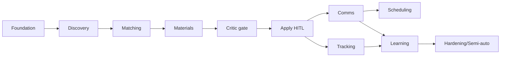

# Implementation Plan — Roadmap, Milestones, Sprints

> Phase 10 · Status: Draft v0.1 · 2026-05-30
> Estimates assume a single part-time developer (Nikhil). Sprints = 2 weeks. Points =
> Fibonacci (relative effort). Detailed task lists in `/tasks/`.

## 1. Milestones
| Milestone | Outcome | Maps to |
|-----------|---------|---------|
| M0 — Foundation | Monorepo, CI, Docker Compose, DB + migrations, config, observability skeleton | NFR-09/11/12 |
| M1 — Discovery+Match | Jobs flow in, scored + ranked; review queue read-only | FR-1xx, FR-2xx |
| M2 — Materials+Apply (HITL) | Tailored docs + approval gate + submit + audit | FR-3xx, FR-4xx, FR-5xx |
| M3 — Comms+Schedule | Gmail monitor, reply drafts, calendar scheduling | FR-6xx, FR-7xx |
| M4 — Learning+Analytics | Outcomes captured, ranking adapts, dashboards | FR-8xx, FR-902 |
| M5 — Hardening | Security pass, evals in CI, semi-auto mode, cloud option | NFR-*, FR-406 |

## 2. Sprint plan (overview)
| Sprint | Theme | Milestone | Key deliverables | ~Pts |
|--------|-------|-----------|------------------|------|
| S1 | Foundation + Discovery | M0→M1 | scaffolding, DB, 1–2 source adapters, dedupe, dashboard shell | 34 |
| S2 | Matching + Materials | M1→M2 | embeddings+scoring+rationale, resume/cover gen, **Critic/fabrication gate** | 39 |
| S3 | Apply (HITL) + Tracking | M2 | approval queue, submit (API + Playwright fallback), audit, state machine, idempotency | 37 |
| S4 | Gmail + Replies | M3 | inbox poll/classify/link, reply drafting, send guardrails | 32 |
| S5 | Scheduling + Analytics | M3→M4 | calendar availability/propose/create, funnel analytics | 29 |
| S6 | Learning + Hardening | M4→M5 | outcome capture, weight updates, evals-in-CI, semi-auto, security checklist | 34 |

Detailed S1–S3 task breakdowns are in `/tasks/sprint-1.md`..`sprint-3.md`; the full
backlog (all sprints) is in `/tasks/backlog.md`.

## 3. Dependencies (critical path)

- Critic/fabrication gate (S2) **blocks** any apply (S3) — safety before action.
- Tracking + comms feed Learning (S6).
- Cloud deploy is optional and parallelizable after M2.

## 4. Story-point summary
| Epic | Pts |
|------|-----|
| Foundation | 21 |
| Discovery & Matching | 34 |
| Materials (incl. Critic) | 28 |
| Apply & Tracking | 30 |
| Comms (inbox+reply) | 27 |
| Scheduling | 13 |
| Learning & Analytics | 23 |
| Hardening & Semi-auto | 21 |
| **Total** | **~197** |

## 5. Definition of Ready / Done
- **Ready:** linked FR/AC, clear acceptance, no blocking unknowns, test approach noted.
- **Done:** see `../requirements/acceptance-criteria.md` global DoD (tests, coverage, docs,
  CLAUDE.md update, ADR if needed, no secrets in logs, audit present).

## 6. Risk-adjusted sequencing notes
- Start with **API/feed sources** (Greenhouse/Lever/RSS) before any browser automation.
- Ship **HITL** fully before considering **semi-autonomous** (S6).
- Keep **budget guard + audit** in from S1 (cheap to add early, painful later).
