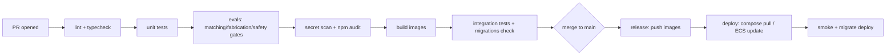

# CI/CD, Monitoring, Logging, Alerting, Deployment

> Phase 8 · Status: Draft v0.1 · 2026-05-30

## 1. CI/CD (GitHub Actions)

- **Pipeline stages:** lint → typecheck → unit → **eval gates** (fabrication=0, safety,
  matching regression) → secret scan + dependency audit → build → integration (spin up
  Postgres+Redis, run migrations) → deploy → smoke.
- **Quality gates (block merge):** type errors, failing tests, fabrication/safety eval
  failures, secret leak, high-sev vuln.
- **Versioning:** images tagged by git sha + semver; migrations run via `prisma migrate
  deploy` in the deploy job.
- Matches Nikhil's existing GitHub Actions + Docker workflow (resume).

## 2. Monitoring (Prometheus + Grafana)
| Metric | Type | Alert |
|--------|------|-------|
| `llm_spend_usd_total` | counter | > alertAtPct of cap |
| `applications_submitted_total` | counter | anomaly (spike) |
| `guardrail_violations_total` | counter | > 0 |
| `unapproved_actions_total` | counter | > 0 (page) |
| `queue_depth{queue}` | gauge | sustained growth |
| `dlq_size{queue}` | gauge | > 0 |
| `reply_draft_latency_seconds` | histogram | P50 > 15 min |
| `source_fetch_errors_total` | counter | spike |
| `agent_run_duration_seconds` | histogram | regressions |

Grafana dashboards: Funnel, Ops health, Cost, Safety.

## 3. Logging
- **Structured JSON** logs (pino) with `traceId`, `opportunityId`, `agent`.
- **OpenTelemetry traces** for agent runs + tool calls (decision traceability).
- **Scrubbing:** secret-redaction layer; CI test asserts no token patterns in logs.
- **Aggregation:** Loki (local) / CloudWatch Logs (AWS).

## 4. Alerting
- Channels: email + optional push (operator).
- **Page-level:** unapproved action, guardrail violation, budget cap, audit chain break.
- **Warn-level:** DLQ growth, source error spikes, reply latency SLO breach, budget threshold.

## 5. Deployment strategy
- **Local:** `docker compose pull && up -d`; migrations run on boot via an init job.
- **Cloud:** rolling ECS service update; run `migrate deploy` as a one-off task before
  shifting traffic; health checks gate rollout; easy rollback to previous image tag.
- **Backups:** verified before destructive migrations (see database backup doc).
- **Zero-downtime not required** for a single-user system, but deploys should be safe +
  reversible.

## 6. Runbooks (to author during implementation)
- Restore from backup · Rotate secrets · Re-auth Google · Clear/replay a DLQ ·
  Pause automation (kill switch) · Investigate a guardrail alert.
