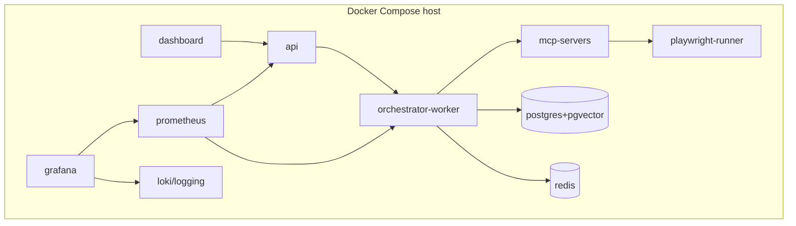
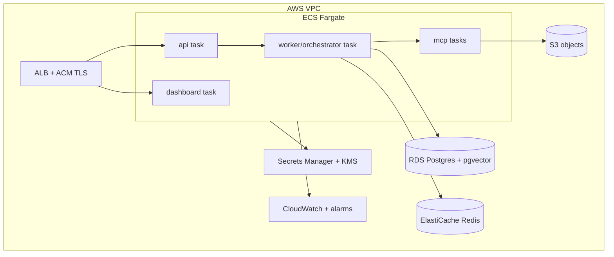

# Infrastructure Design — Docker & AWS

> Phase 8 · Status: Draft v0.1 · 2026-05-30 · Strategy: local-first, cloud-ready

## 1. Docker architecture (local / single-host)

- **Services:** `dashboard` (Next.js), `api`, `orchestrator-worker` (LangGraph + BullMQ
  consumers), `postgres` (pgvector image), `redis`, `mcp-servers` (one or a few containers),
  `playwright-runner` (isolated), plus optional `prometheus`/`grafana`/`loki`.
- **Images:** multi-stage Node 20 Alpine; non-root user; pinned digests.
- **Volumes:** `pgdata`, `objstore` (or MinIO for S3-compatible local), `secrets`.
- **Networking:** internal bridge network; only `dashboard` exposed to localhost.
- **One command:** `docker compose up` brings the whole system up locally.

## 2. AWS architecture (cloud path)

- **Compute:** ECS Fargate services (dashboard/api/worker/mcp). Autoscale worker on queue depth.
- **Data:** RDS PostgreSQL (pgvector) Multi-AZ optional; ElastiCache Redis; S3 (encrypted).
- **Secrets:** Secrets Manager/SSM + KMS.
- **Edge:** ALB + ACM TLS; WAF optional; dashboard behind auth.
- **Cost control:** smallest viable instances; scale-to-zero workers when idle; budget alarms.

## 3. Environments
| Env | Purpose | Infra |
|-----|---------|-------|
| local | dev + primary run | Docker Compose |
| staging (optional) | pre-prod validation | minimal ECS or a VPS |
| prod | live use | Docker Compose on VPS **or** AWS ECS |

## 4. Configuration & parity
- 12-factor: all config via env/secrets; same images across envs.
- `compose` (local) and `ecs task defs` (cloud) consume the same container images.
