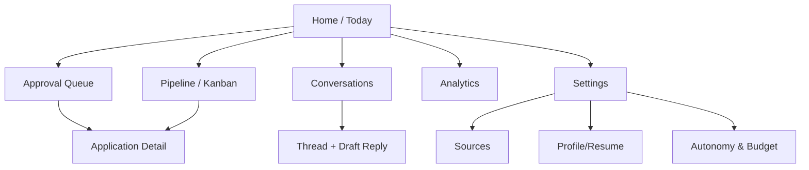
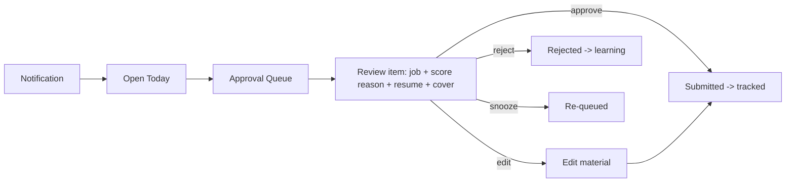
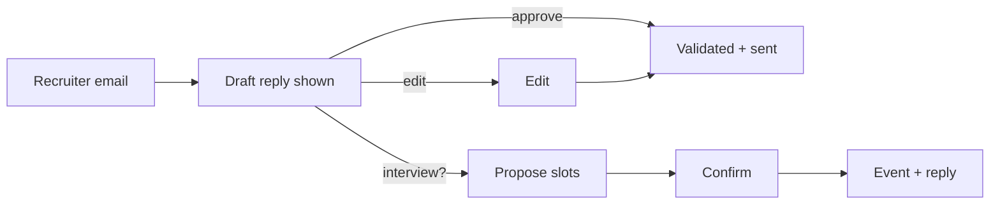

# Product / UX Design — Dashboard

> Phase 9 · Status: Draft v0.1 · 2026-05-30
> The dashboard is the human control plane. Design goal: approvals in <30s, on mobile.

## 1. Screen map


## 2. Key screens & primary actions
| Screen | Purpose | Primary actions |
|--------|---------|-----------------|
| Today | What needs me now | Approve queue, view alerts, KPIs |
| Approval Queue | Review pending applications/replies | Approve / Edit / Reject / Snooze (batch) |
| Application Detail | Job + match rationale + resume + cover | Edit material, approve, view audit |
| Pipeline (Kanban) | Lifecycle overview | Move/inspect, follow-up on stalled |
| Conversations | Recruiter threads | Review draft reply, approve send, propose slots |
| Thread Detail | One thread + context | Edit/approve reply, schedule |
| Analytics | Funnel + what's working | Filter by source/role/variant |
| Settings | Config | Sources, profile, autonomy mode, budget, schedules |

## 3. User flows
### Daily approval flow

### Reply flow


## 4. Wireframes (ASCII)
### Approval Queue (list)
```
┌ Approval Queue ───────────────────────────── 7 pending ┐
│ [ Senior Node.js Engineer · Acme ]   Match 86 · Conf .82│
│   Why: Node+AWS+microservices match; remote ✓          │
│   resume.pdf · cover.txt        [Approve] [Edit] [Skip] │
│ ----------------------------------------------------- │
│ [ Full-Stack Engineer · Globex ]     Match 79 · Conf .74│
│   Why: React+Postgres match; comp unknown ⚠            │
│   resume.pdf · cover.txt        [Approve] [Edit] [Skip] │
│ [ Approve all ≥ 85 ]                                    │
└────────────────────────────────────────────────────────┘
```
### Application Detail
```
┌ Senior Node.js Engineer — Acme ───────────────────────┐
│ Match 86  Confidence .82   State: PENDING_APPROVAL     │
│ ┌ Rationale ──────────────┐ ┌ Tailored Resume ───────┐│
│ │ + Node/Express/AWS      │ │ [PDF preview]          ││
│ │ + Microservices/RabbitMQ│ │ claims✓ grounded       ││
│ │ - No K8s depth (minor)  │ └────────────────────────┘│
│ └─────────────────────────┘ ┌ Cover Letter ──────────┐│
│ [Approve] [Edit] [Reject]   │ [text preview]         ││
│ Audit: created 12:03 by sys └────────────────────────┘│
└───────────────────────────────────────────────────────┘
```
### Conversation / Thread
```
┌ Acme — Recruiter thread ──────────────────────────────┐
│ ▸ Recruiter: "Are you available this week?"  (invite)  │
│ ┌ Drafted reply ───────────────────────────────────┐  │
│ │ Hi Sam, thanks! I'm open Tue 3pm or Wed 11am IST. │  │
│ └───────────────────────────────────────────────────┘  │
│ Proposed slots: ◉ Tue 15:00  ○ Wed 11:00  ○ Thu 16:00  │
│ [Approve & Send] [Edit] [Propose other times]          │
└────────────────────────────────────────────────────────┘
```

## 5. Analytics & reporting
- **Funnel:** discovered → matched → applied → responded → interview → offer.
- **Conversion by:** source, role type, resume variant, match-score band.
- **Time series:** applications/week, response rate, reply latency.
- **Cost:** LLM spend vs. budget.
- **Exports:** CSV/Markdown weekly summary; optional emailed digest.

## 6. UX principles
- Decision-first: every review item leads with *what to decide* + *why*.
- Trust signals: show grounding (claims✓), rationale, and audit.
- Batch + keyboard: approve-all-above-threshold; keyboard shortcuts.
- Mobile-friendly: queue + approve flows usable on a phone.
- Reversibility: nothing irreversible without confirm; clear undo where possible.
- Tech: Next.js + Tailwind + TanStack Query + WebSocket live updates (Nikhil's stack).
